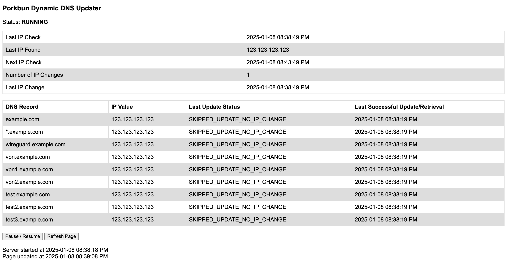

# porkbun-dynamic-dns
Automatically update porkbun dynamic DNS records with your up to date public IP

### Features:
- Runs on a schedule (default 5 minutes)
- Creates new DNS records if they do not already exist
- Simple UI to monitor DNS update statuses



### Running:

First, make a copy of `.env.example` called `.env` and populate the config fields with your information

Then, from the project directory run the following:

```
npm i
npm start
```
